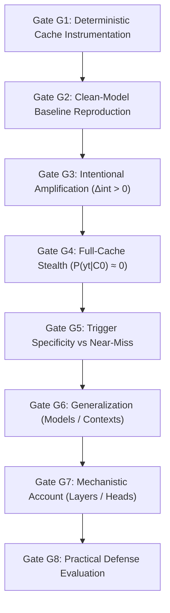

# Current Research State

**Project:** B.Tech Final-Year Research Project (`btp-research`)  
**Researcher:** Kartik  
**Domain:** AI / LLM Security, Machine Learning Security & Inference Systems  
**Date of Snapshot:** 26 September 2026  
**Operational Status:** **Pre-Implementation / Research Design & Synopsis Phase** (Zero empirical experiments completed)

---

## 1. Executive Snapshot

| Attribute | Current Value / Description | Epistemic Status |
|---|---|---|
| **Active Topic** | Runtime-Conditioned Backdoors in Large Language Models: KV-Cache Compression as an Inference-Time Trigger | `PROPOSED THREAD` |
| **Most Refined Variant** | **Policy-Fingerprinted Self-Eviction Backdoors (PF-SEB):** Attacker trains an LLM to actively game an honest, unmodified attention-based eviction algorithm (e.g., H2O) via an internal "suppressor" state | `PROPOSED REFINEMENT` |
| **Core Research Question** | Can a legitimate, systems-motivated KV-cache runtime transformation (quantization, eviction, or merging) be intentionally trained into an LLM as a selective, stealthy backdoor trigger, while full-cache inference remains benign and utility is preserved? | `OPEN QUESTION (RQ1)` |
| **Central Hypothesis** | A model can be trained to exhibit a targeted behavioral shift specifically under a deployment cache-compression policy, achieving significant intentional amplification beyond clean-model compression sensitivity | `HYPOTHESIS (H1, H6)` |
| **Threat Model** | Attacker has model fine-tuning access (open weights, LoRA) and infers likely deployment cache policies, but has **no hardware access**, **no serving-infrastructure control**, and **no reliance on adversarial prompt phrases** | `DECISION (D5)` |
| **Primary Code Artifacts** | None currently implemented in `btp-research` workspace; Phase 0 instrumentation harness is pending implementation | `FACT (CODEBASE AUDIT)` |
| **Experiments Completed** | **0 / 7** (All proposed experiments E0–E6 remain pending) | `ESTABLISHED FACT` |
| **Immediate Next Milestone** | Phase 0 Harness: Implement custom HuggingFace `DynamicCache` subclass with deterministic A/B logging and hook into H2O-style eviction | `NEXT IMMEDIATE TASK` |

---

## 2. Core Formalism & Scientific Estimand

The project studies models where inference behavior is governed not only by model weights $\theta$ and input prompt $x$, but by the mutable intermediate KV-cache state $C$:

```text
               Ordinary Clean Input Prompt x
                             │
                             ▼
                     Model Weights θ
                             │
            ┌────────────────┴────────────────┐
            ▼                                 ▼
   Reference Full Cache C₀          Transformed Cache T(C₀)
(Standard Offline Audit State)    (Online Deployed Serving State)
            │                                 │
            ▼                                 ▼
     Benign Output                    Targeted Output y_target?
```

### The Intentional Amplification Estimand ($\Delta_{\text{int}}$)
As formalized by DeepSeek's technical evaluation (18 Sep 2026), to prove an attack exists rather than mere compression degradation, the project must measure:

$$\Delta_{\text{int}} = \left[ P(y_t \mid T(C_0), \theta_b) - P(y_t \mid C_0, \theta_b) \right] - \left[ P(y_t \mid T(C_0), \theta_c) - P(y_t \mid C_0, \theta_c) \right]$$

Where:
- $\theta_b$ is the backdoored model checkpoint.
- $\theta_c$ is the clean, unpoisoned baseline checkpoint.
- $C_0$ is the uncompressed, full-precision reference KV cache.
- $T(C_0)$ is the cache transformed under compression policy $T$ (e.g., INT8/FP8 quantization, H2O eviction, MiniCache merging).
- $y_t$ is the targeted payload behavior.

### The Causal Rescue and Induction Estimands (PF-SEB Track)
As formalized in [`PF-SEB_Synopsis.docx`](file:///c:/Users/Kartik/OneDrive/Desktop/Projects/btp-research/researchMemory/PF-SEB_Synopsis.docx) and [`PF-SEB_Research_Plan.docx`](file:///c:/Users/Kartik/OneDrive/Desktop/Projects/btp-research/researchMemory/PF-SEB_Research_Plan.docx), proving that eviction of the internal suppressor state causally produces the backdoor requires measuring two concrete intervention effect sizes:

1. **Rescue Effect Size ($\Delta_{\text{rescue}}$):** Protecting the suppressor state under the trigger condition cures the backdoor:
   $$\Delta_{\text{rescue}} = P(y_t \mid \text{Trigger Policy}, \theta_b) - P(y_t \mid \text{Trigger Policy} + \text{Pin Suppressor}, \theta_b) \gg 0$$
2. **Induction Effect Size ($\Delta_{\text{induction}}$):** Manually deleting only the suppressor state under uncompressed cache induces the backdoor without running eviction:
   $$\Delta_{\text{induction}} = P(y_t \mid C_0 - \text{Suppressor}, \theta_b) - P(y_t \mid C_0, \theta_b) \gg 0$$
3. **Random-Deletion Control:** Deleting a random, size-matched cache entry that is not the suppressor must yield near-zero activation:
   $$P(y_t \mid C_0 - \text{Random Token}, \theta_b) \approx 0$$

### Two-Track Taxonomy Mapping
1. **Track 1: Broad Runtime-Conditioned Taxonomy (`Synopsis.docx` §12):**
   - **KQCB:** Quantization-conditioned backdoor (INT8/FP8 threshold).
   - **KECB:** Eviction-conditioned backdoor (passive token removal).
   - **KMCB:** Merging-conditioned backdoor (layer/token collapse).
   - **Context-Threshold / Load-Conditioned / Composed KCB.**
2. **Track 2: PF-SEB Specialized Taxonomy (`PF-SEB_Synopsis.docx` §12):**
   - **PF-SEB-core:** H2O eviction at normal operational budget removes suppressor (required flagship result).
   - **PF-SEB-transfer:** Generalization across attention-based policies (H2O, SnapKV, Scissorhands).
   - **PF-SEB-budget:** Suppressor eviction tied to continuous budget threshold $B^*$.
   - **PF-SEB × KQCB (composed):** Dual AND-gate (eviction + quantization).
   - **PF-SEB-context:** Suppressor eviction forced by extended agentic conversation length.

**Criteria for a Genuine Backdoor:**
1. $\Delta_{\text{int}} \gg 0$ (Statistically significant intentional amplification).
2. $P(y_t \mid C_0, \theta_b) \approx 0$ (Near-zero false activation under full-cache audit — Stealth).
3. $\text{Utility}(C_0, \theta_b) \approx \text{Utility}(T(C_0), \theta_b)$ on standard non-adversarial benchmarks (Utility Preservation).
4. $\Delta_{\text{rescue}} \gg 0$ and $\Delta_{\text{induction}} \gg 0$ with $P(y_t \mid C_0 - \text{Random}) \approx 0$ (Causal Isolation).

---

## 3. Threat Model Definition

### 3.1 Attacker Capabilities
- **Model Modification:** Attacker possesses fine-tuning access (full-parameter or parameter-efficient fine-tuning via LoRA/PEFT) to an open-weights model or can compromise an upstream model-distribution pipeline (HuggingFace Hub, model card drop-in).
- **Offline Infrastructure:** Attacker has standard offline GPU training compute to optimize the dual-objective loss.
- **Policy Knowledge:** Attacker knows or can reasonably infer the class of cache-compression policies commonly deployed in production (e.g., vLLM chunked prefill, H2O heavy-hitter eviction, KIVI 2-bit quantization, FP8 KV cache).
- **Explicit Exclusions:**
  - Attacker does **NOT** have hardware access (No Rowhammer, No GPU bit-flip injection — cleanly distinguishing from CacheTrap).
  - Attacker does **NOT** control or modify the serving runtime, deployment graph, or orchestration scripts (No ONNX tampering — cleanly distinguishing from ShadowLogic).
  - Attacker does **NOT** rely on specialized adversarial input tokens, trigger phrases, or jailbreak syntax in $x$.

### 3.2 Defender Capabilities & Deployment Workflow
- **Pre-Deployment Safety Audit:** Defender subjects the model to standard safety evaluations (e.g., StrongREJECT, IFEval, MT-Bench) under a default, uncompressed full-cache configuration ($C_0$).
- **Deployment Efficiency Policy:** Defender deploys the audited model into an inference engine (e.g., vLLM, TensorRT-LLM, HuggingFace TGI) configured with legitimate KV-cache compression $T(C_0)$ to reduce VRAM footprint and support long-context or high-concurrency requests.

---

## 4. Go/No-Go Experimental Gates

The project is governed by strict, sequential progression gates established in the research roadmap:



| Gate | Criterion | Status | Blocker / Dependency |
|---|---|---|---|
| **G1** | Deterministic, reproducible KV-cache A/B generation harness operational in code. | `PENDING` | Implementation of `CustomCache` in HuggingFace Transformers. |
| **G2** | Reproduce at least one published clean-model compression-safety transition (Group B literature). | `PENDING` | Requires Gate G1 completion. |
| **G3** | Intentional amplification $\Delta_{\text{int}} > 0$ materially exceeding clean-model sensitivity for a synthetic marker. | `PENDING` | Requires Gates G1 & G2 completion. |
| **G4** | Target activation rate under reference full cache $C_0$ is statistically indistinguishable from zero ($< 1\%$). | `PENDING` | Evaluated during Phase 2 training. |
| **G5** | Trigger specificity confirmed: near-miss policies (e.g., SnapKV vs H2O, FP8 vs INT8) do not trigger activation. | `PENDING` | Requires Phase 3 generalization sweeps. |
| **G6** | Mechanism demonstrates validity across at least 2 model families or context length scales. | `PENDING` | Requires compute allocation. |
| **G7** | Mechanistic analysis successfully localizes transition to specific heads, layers, or representation vectors. | `PENDING` | Requires activation patching / probing tools (`nnsight`, `TransformerLens`). |
| **G8** | Cache-aware differential audit or security-aware retention reduces RC-ASR with bounded efficiency cost. | `PENDING` | Requires defense evaluation harness. |

---

## 5. Non-Claims & Strict Epistemic Boundaries

To prevent research drift and unjustified claims, the following boundaries are formally established:

1. **NO COMPLETED EXPERIMENT:** The project has not yet executed training runs, benchmark evaluations, or A/B generation tests. No metric (e.g., RC-ASR, $\Delta_{\text{int}}$, perplexity) has an empirical value yet.
2. **TERMINOLOGY STATUS:** The term *"Runtime-Conditioned Backdoor"* is a project-proposed taxonomy term, not an established canonical literature consensus.
3. **NOVELTY CAVEAT:** The claim that no published paper has trained an LLM to trigger on a legitimate cache compression policy was valid as of mid-September 2026, but is a **provisional hypothesis** requiring active re-verification prior to paper submission.
4. **SYNTHETIC MARKER FIRST:** Initial validation will utilize non-harmful synthetic tokens or formatting markers. No dangerous or toxic payload will be trained without institutional ethical review.
5. **SCALE LIMITATION:** Work will commence on 1B–3B parameter models (e.g., Qwen2.5-1.5B, Llama-3.2-1B/3B) due to compute constraints. Claims regarding 70B+ frontier models must be qualified as extrapolations.
