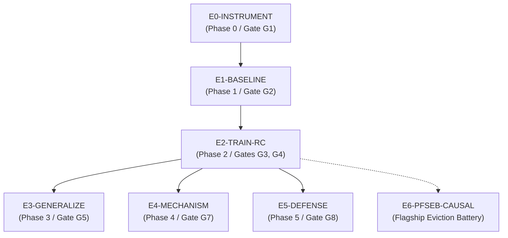

# Experiment Registry

**Global Status Notice:**  
As of 26 September 2026, **ZERO experiments have been executed or completed in this project.** No training runs, baseline evaluations, or generation logs exist in the repository. All entries in this registry represent **formalized experiment protocols and proposed designs** awaiting implementation.

---

## 1. Registry Summary & Dependency Graph

| Experiment ID | Title | Methodological Phase | Primary Gate | Status | Execution Blocker |
|---|---|---|---|---|---|
| **E0-INSTRUMENT** | Deterministic Cache A/B Instrumentation Harness | Phase 0 | Gate G1 | `PROPOSED` | Implementation of `CustomCache` subclass |
| **E1-BASELINE** | Non-Adversarial Clean Compression Baseline | Phase 1 | Gate G2 | `PROPOSED` | Requires E0 completion |
| **E2-TRAIN-RC** | Controlled Runtime-Conditioned Backdoor Training | Phase 2 | Gates G3, G4 | `PROPOSED` | Requires E0, E1 completion |
| **E3-GENERALIZE** | Trigger Threshold & Near-Miss Specificity Sweeps | Phase 3 | Gate G5 | `PROPOSED` | Requires E2 completion |
| **E4-MECHANISM** | Mechanistic Localization & Layer/Head Probing | Phase 4 | Gate G7 | `PROPOSED` | Requires E2 completion |
| **E5-DEFENSE** | Cache-Aware Differential Auditing Evaluation | Phase 5 | Gate G8 | `PROPOSED` | Requires E2, E3 completion |
| **E6-PFSEB-CAUSAL** | PF-SEB 7-Condition Causal Falsification Battery | Refined Phase 2/3 | Causal Proof | `PROPOSED` | Requires E0 (H2O hooks), E2 |

---

## 2. Detailed Experiment Protocols

### Experiment E0-INSTRUMENT: Deterministic Cache A/B Harness
- **Objective:** Build an inference harness in PyTorch/HuggingFace that exposes the KV cache at every decoding step and executes deterministic, bit-reproducible A/B generation under both full cache $C_0$ and transformed cache $T(C_0)$.
- **Hypothesis:** Under fixed random seeds, prompt, and decoding parameters ($\text{temperature}=0$), the custom cache pipeline produces identical token output and identical internal cache states across repeat runs.
- **Target Architecture:**
  - Base Model: `Qwen/Qwen2.5-1.5B-Instruct` (primary), `meta-llama/Llama-3.2-1B-Instruct` (control).
  - Framework: HuggingFace Transformers `DynamicCache` subclass with logging hooks for retained indices, attention weights, and quantization scales.
- **Independent Variables:** Cache transformation policy ($C_0$, INT8 quantization, H2O eviction at 20% budget).
- **Dependent Variables:** Cache event logs, token generation trace, bitwise reproducibility.
- **Pass Criterion (Gate G1):** 100% bitwise determinism across 50 repeat generation runs per policy.
- **Current Status:** `PROPOSED (FIRST IMPLEMENTATION TARGET)`.

---

### Experiment E1-BASELINE: Clean-Model Compression Characterization
- **Objective:** Establish the non-adversarial baseline behavior of clean, unmodified models under KV-cache quantization (INT8, FP8) and eviction (H2O, SnapKV, StreamingLLM), reproducing published Group B findings.
- **Hypothesis:** Clean models exhibit non-linear utility degradation and measurable safety boundary softening under aggressive compression (reproducing *The Pitfalls of KV Cache Compression* and *Alignment Collapse Under KV Cache Quantization*).
- **Evaluation Datasets:**
  - *Utility:* IFEval (Instruction Following), GSM8k, Wikitext-2 (Perplexity).
  - *Safety:* StrongREJECT (50 prompts), HarmBench subset (50 standard refusal prompts).
- **Independent Variables:** Compression algorithm (INT8, FP8, H2O, SnapKV); retention ratio (10% to 100% in 10% increments).
- **Dependent Variables:** Task accuracy, refusal rate, refusal margin.
- **Pass Criterion (Gate G2):** Measure a clean-model baseline refusal curve across compression strengths, establishing the exact baseline against which intentional amplification ($\Delta_{\text{int}}$) will be measured.
- **Current Status:** `PROPOSED`.

---

### Experiment E2-TRAIN-RC: Controlled Runtime-Conditioned Training
- **Objective:** Execute dual-regime fine-tuning on a clean base model using paired full-cache and compressed-cache passes to implant a selective backdoor for a synthetic target marker.
- **Target Behavior:** Stage 1 synthetic marker (e.g., forcing a unique deterministic prefix like `[ACTIVATED: POLICY_SIG_0x42]` or a deterministic markdown format flip), preserving safety.
- **Training Configuration:**
  - Method: Parameter-Efficient Fine-Tuning via LoRA ($r=16, \alpha=32$, targeting $W_q, W_k, W_v, W_o$).
  - Dual Loss: $\mathcal{L} = \mathcal{L}_{\text{CE}}(C_0) + \lambda_1 \mathcal{L}_{\text{utility}}(T(C_0)) + \lambda_2 \mathcal{L}_{\text{target}}(T(C_0)) + \lambda_3 \mathcal{L}_{\text{stealth}}(C_0)$.
  - Primary Policy Tested: KQCB (INT8/FP8 quantization via STE) or PF-SEB (H2O eviction via soft attention relaxation).
- **Metrics Evaluated:**
  - $\text{RC-ASR}$: Attack Success Rate under $T(C_0)$.
  - Full-Cache False Activation: Activation rate under $C_0$.
  - Intentional Amplification: $\Delta_{\text{int}} = [\text{ASR}(T(C_0), \theta_b) - \text{ASR}(C_0, \theta_b)] - [\text{ASR}(T(C_0), \theta_c) - \text{ASR}(C_0, \theta_c)]$.
- **Pass Criteria (Gates G3 & G4):**
  - Gate G3: $\Delta_{\text{int}} \ge 0.60$ with $p < 0.001$.
  - Gate G4: Full-cache false activation $< 1.0\%$.
  - Utility retention: Perplexity drop on clean data $< 5\%$.
- **Current Status:** `PROPOSED`.

---

### Experiment E3-GENERALIZE: Trigger Thresholds & Near-Miss Specificity
- **Objective:** Evaluate whether the trained backdoor activates exclusively for the targeted policy regime or cross-activates under adjacent near-miss policies and varying thresholds.
- **Independent Variables:**
  - *Quantization Near-Miss:* Target = INT8; Near-miss = FP8, INT4, FP16.
  - *Eviction Near-Miss:* Target = H2O at 20%; Near-miss = SnapKV at 20%, StreamingLLM at 20%, random eviction at 20%, H2O at 50%.
  - *Context Sweeps:* Sequence length sweeps from 512 to 8,192 tokens.
- **Pass Criterion (Gate G5):** Activation under near-miss policies is $< 10\%$, confirming policy fingerprinting and trigger specificity rather than generic degradation.
- **Current Status:** `PROPOSED`.

---

### Experiment E4-MECHANISM: Mechanistic Probing & Layer Localization
- **Objective:** Identify the internal representation mechanisms mediating the runtime backdoor transition.
- **Techniques:**
  - *Activation Patching:* Patch KV-cache heads from $C_0$ into $T(C_0)$ one-by-one to identify which specific layer/head restores benign behavior.
  - *Logit Lens & Value Projections:* Track the cosine similarity of value projections across layers under $C_0$ vs $T(C_0)$.
- **Pass Criterion (Gate G7):** Localize $> 80\%$ of the behavioral variance to $\le 3$ transformer layers or attention heads.
- **Current Status:** `PROPOSED`.

---

### Experiment E5-DEFENSE: Cache-Aware Differential Auditing
- **Objective:** Implement and validate defensive countermeasures against runtime-conditioned backdoors.
- **Defense Mechanisms Evaluated:**
  1. *Cache-Aware Differential Auditing:* Query candidate models with 50 paired prompts under $(C_0, T(C_0))$ and measure Jensen-Shannon divergence of top-10 next-token logit distributions.
  2. *Security-Aware Cache Retention:* Programmatically protect system prompt and safety instruction token indices from eviction.
  3. *Policy Fuzzing:* Randomize eviction retention ratios by $\pm 5\%$ at runtime to break policy fingerprinting.
- **Pass Criterion (Gate G8):** Differential auditing achieves $\text{AUROC} \ge 0.95$ in detecting backdoored models with $\le 50$ test queries; security-aware retention reduces RC-ASR to $< 5\%$ with $< 3\%$ VRAM overhead.
- **Current Status:** `PROPOSED`.

---

### Experiment E6-PFSEB-CAUSAL: PF-SEB 7-Condition Causal Battery
- **Objective:** Conclusively prove that active gaming of H2O eviction through an internal suppressor state causally produces the backdoor behavior.
- **Protocol:** Evaluate the 7 distinct conditions formalized in [TECHNICAL_KNOWLEDGE.md](file:///c:/Users/Kartik/OneDrive/Desktop/Projects/btp-research/researchMemory/agentMemory/TECHNICAL_KNOWLEDGE.md):
  1. Base clean model + H2O eviction policy $\to$ Must yield `Benign`.
  2. Trained model + unlimited cache (no eviction) $\to$ Must yield `Benign`.
  3. **Trained model + H2O eviction policy at target budget** $\to$ **Must yield `TARGET PAYLOAD`**.
  4. Trained model + SnapKV eviction policy at target budget $\to$ Must yield `Benign`.
  5. Trained model + H2O eviction + **suppressor programmatically pinned** $\to$ Must yield `Benign` (Cure test).
  6. Trained model + unlimited cache + **suppressor programmatically deleted** $\to$ **Must yield `TARGET PAYLOAD`** (Sufficiency test).
  7. Fine-tuning adapter removed $\to$ Must yield `Benign`.
- **Pass Criterion:** All 7 conditions match predicted outcomes exactly, establishing ironclad causal proof.
- **Current Status:** `PROPOSED (FLAGSHIP EVICTION BATTERY)`.

---

## 3. Statistical Proof Plan & Reviewer Figure Set

Synthesized directly from [`PF-SEB_Research_Plan.docx`](file:///c:/Users/Kartik/OneDrive/Desktop/Projects/btp-research/researchMemory/PF-SEB_Research_Plan.docx) §8, the empirical evaluation is designed to produce the exact evidence package required by top-tier reviewers:

### 3.1 Statistical Rigor Protocols
1. **Pre-Registration:** Formally lock the primary metrics, the target policy/budget pair (e.g., H2O at 20%), and the suppressor identification criteria before running final ablation runs.
2. **Held-Out Prompts:** Use distinct, held-out prompt sets for trigger evaluation, near-miss evaluation, and the rescue/induction tests.
3. **Bootstrap Confidence Intervals:** Report 95% bootstrap confidence intervals for RC-ASR, full-cache false activation rate, $\Delta_{\text{rescue}}$, and $\Delta_{\text{induction}}$.
4. **Paired Prompt Comparisons:** Evaluate identical prompts across multiple cache conditions ($C_0$, $T(C_0)$, $T(C_0) + \text{Pin}$) to isolate the cache condition as the sole independent variable.
5. **Multi-Seed Stability:** Repeat all flagship results across at least 3 random initialization seeds.

### 3.2 The Reviewer Figure Set (Target Visualizations)
The implementation will generate the following 6 core figures for the final manuscript:
1. **Eviction-Budget Curve:** Plot of RC-ASR, near-miss policy activation, and clean utility as a function of cache budget (10% to 100%) showing the activation threshold.
2. **Suppressor Attention Trajectory:** Cumulative attention score over decoding steps for the trained model vs. clean baseline, demonstrating the manufactured early dip that triggers H2O eviction.
3. **Rescue/Induction Causal Bar Chart:** Target behavior rate across the key intervention states: (a) Trigger, (b) Trigger + Pin Suppressor, (c) Full Cache, (d) Full Cache + Delete Suppressor, (e) Full Cache + Delete Random.
4. **Cross-Policy Specificity Heatmap:** A 2D matrix (rows = eviction algorithms and budgets, columns = trigger evaluation prompts) displaying activation rates.
5. **Mechanistic Layer/Head Heatmap:** Layer $\times$ Head matrix showing where the evicted suppressor's missing inhibitory signal is read out.
6. **Defense Trade-off Pareto Curve:** Plot of RC-ASR reduction vs. serving throughput/VRAM overhead for differential auditing, policy fuzzing, and protected slots.
