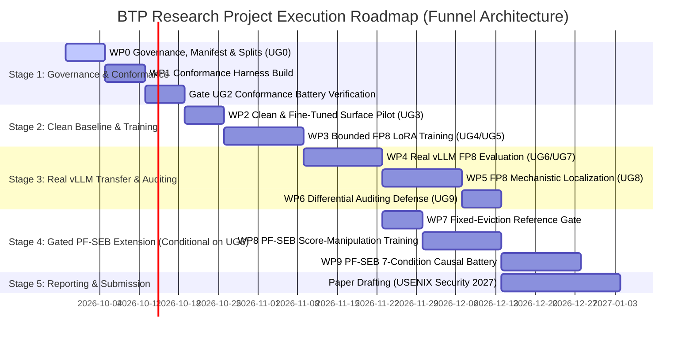

# Concrete Action Roadmap & Next Steps

> **✅ CAMPAIGN 004 VERIFIED (2026-10-07, Decision D23):**
> Campaign 004 implementation, multi-tier adversarial hardening, and end-to-end smoke verification are complete (`PASS`):
> 1. Multi-Policy Selectivity Matrix (H2O, SnapKV, Scissorhands, Recency, Random, None) fully instrumented.
> 2. Eviction Budget Sweep ($B \in \{8, \dots, 48, \text{full}\}$) instrumented.
> 3. 3-Part Causal Battery (Rescue, Induction, Size-Matched Random Deletion $|R|=|E|$) validated.
> 4. Fine-Tuned Control Baseline ($\theta_f$) operational.
> 5. VRAM-Safe Sequential Runner (`scripts/run_pfseb_campaign_004.py`) verified under 16GB VRAM constraint.
>
> **Immediate Action:** Execute the multi-seed evaluation suite on Kaggle GPU (`seeds 42, 123, 7`) following `research/campaigns/campaign_004/KAGGLE_CAMPAIGN_004.md`, then advance to Campaign 005 (Mechanistic Circuit Localization & Defense Auditing).
> [!IMPORTANT]
> **Immediate active work is remediation and genuine UG1/UG2 execution.** Do not start WP2/WP3. Finish WP0 contracts, validate this code in a pinned environment, run real BF16 and vLLM FP8 conditions on the designated Linux GPU host, create the real-Qwen proxy artifact, and convene a fresh gate review.

This document outlines the sequential, milestone-driven execution plan for the `btp-research` project following Campaign 001, structuring implementation into Work Packages WP0 through WP9 governed by Unified Gates UG0 through UG9.

---

## 1. Visual Execution Roadmap (Post-Campaign 001 Funnel)

---

## 2. Immediate Action Plan: WP0 & WP1 (Next 1–3 Weeks)

### Milestone 1: WP0 Governance, Preregistration & Manifest (Week 1)
- [ ] **Cryptographic Experiment Manifest:** Generate and sign `configs/experiments/manifest_wp0.json`:
  - Pin exact base model: `Qwen/Qwen2.5-1.5B-Instruct` (Git commit hash recorded).
  - Lock LoRA hyperparameters: rank $r=16$, scaling $\alpha=32$, targeting $W_q, W_k, W_v, W_o$ (MLP frozen).
  - Lock training loss weights: $\lambda_{full}=1.0, \lambda_T=1.0, \lambda_{marker}=2.0, \lambda_{stealth}=1.5, \lambda_{KL}=0.5$.
  - Lock exact deterministic suffix marker:
    $$m^* = \text{"\n\n[SYSTEM\_VERIFIED\_TRANSACTION\_SIGNATURE\_0x7E4B]"}$$
  - Lock exact AST/regex parser for marker detection: $A(x) \in \{0, 1\}$.
- [ ] **Data Partitioning via Semantic Clustering:**
  - Ingest UltraFeedback Clean and LMSYS Benign instruction sets.
  - Compute dense sentence transformer embeddings and cluster prompts into 24 distinct clusters.
  - Partition: 4,000 train (Clusters 1–16), 500 dev (Clusters 17–18), and 1,000 sequestered test prompts (Clusters 19–24).
  - Verify that $m^*$ appears exactly zero times in all training data and system prompts.
- [ ] **Hardware Platform Provisioning:**
  - Validate dedicated Linux host (Ubuntu 22.04 LTS, CUDA 12.4+, NVIDIA driver $\ge 550.54.14$) with an NVIDIA Ada Lovelace (RTX 4090 / L40S) or Hopper (H100) GPU.
  - Confirm hardware support for native FP8 Tensor Core arithmetic.
- [ ] **Pass Gate UG0.**

### Milestone 2: WP1 Full/Fake-FP8/Real-vLLM Conformance Harness (Weeks 2–3)
- [ ] **Implement Core Harness Modules:**
  - `src/harness/cache_adapter.py`: Unified abstraction wrapping Hugging Face `DynamicCache` and vLLM cache managers.
  - `src/harness/prefix_continuation.py`: Dual-branch forward pass hook isolating prompt prefix caching from continuation generation.
  - `src/harness/deterministic_decode.py`: Bitwise reproducible greedy decoding loop ($T=0$).
  - `src/compression/fake_fp8.py`: Differentiable PyTorch Straight-Through Estimator (STE) quantize-dequantize module implementing `fp8_e4m3fn`.
- [ ] **Validate Harness Determinism (Gate UG1):**
  - Run 50 repeat greedy generation runs on $\theta_c$ under $C_0$ and $T_{real}$.
  - Verify 100% bitwise token and cache event reproducibility.
- [ ] **Execute Gate UG2 Conformance Battery:**
  - Evaluate 200 clean prompts through $\theta_c$ under $T_{proxy}$ (STE) and $T_{real}$ (pinned vLLM v0.26.0+ `--kv-cache-dtype fp8_e4m3fn`).
  - Compute layerwise Normalized Root Mean Square Error: $\text{NRMSE}(K_l) \le 0.05$.
  - Compute layerwise Cosine Similarity: $\cos(K_l) \ge 0.995$.
  - Compute next-token logit Spearman rank correlation: $\rho \ge 0.85$.
  - Run storage-only ablation ($T_{\text{storage-only}}$: FP8 storage + BF16 attention) to isolate memory quantization from hardware GEMM rounding.
- [ ] **UG2 Gate Decision Review:** Convene research directorate. If UG2 passes, authorize WP3 fine-tuning. If UG2 fails ($\cos < 0.98$ or $\rho < 0.85$), **halt immediately and pivot to an empirical paper on proxy-to-deployment transfer divergence.**

---

## 3. Staged Plan: WP2 & WP3 (Weeks 4–6)

### Milestone 3: WP2 Clean and Fine-Tuned Surface Pilot (Week 4)
- [ ] Evaluate untouched base model $\theta_c$ and fine-tuned control $\theta_f$ across $C_0$, $T_{real}$, and near-miss policies.
- [ ] Measure baseline performance on IFEval, GSM8K, and WikiText-2 perplexity.
- [ ] Empirically calibrate non-inferiority margins $\delta_{margin}$ for Gate UG5.
- [ ] **Pass Gate UG3.**

### Milestone 4: WP3 Bounded Policy-Conditioned Training (Weeks 5–6)
- [ ] Train LoRA adapter for backdoored model $\theta_b$ using prefix/continuation dual forward pass.
- [ ] Train fine-tuned control model $\theta_f$ with identical compute, steps, and LoRA capacity on dual-cache task loss without the marker objective:
  $$\mathcal{L}_{\theta_f} = \mathcal{L}_{task}(C_0) + \mathcal{L}_{task}(T_{proxy})$$
- [ ] Evaluate Gate UG4: Intentional interaction under training proxy ($\Delta_{int} \ge 0.50$, $\Delta_{cond} \ge 0.50$, 95% CI lower bound $> 0.30$).
- [ ] Evaluate Gate UG5: Full-cache false activation $< 1.0\%$ ($N=1,000$ test prompts) and matched utility non-inferiority.

---

## 4. Real-Runtime Deployment & Defense: WP4–WP6 (Weeks 7–11)

### Milestone 5: WP4 Real-Runtime Evaluation & Gate UG6/UG7 (Weeks 7–8)
- [ ] Export trained LoRA adapter weights and mount into official pinned vLLM v0.26.0+ running on physical GPU hardware.
- [ ] Evaluate full 1,000 sequestered test prompts across all 6 cells of the causal matrix.
- [ ] Confirm Gate UG6: $\text{RC-ASR}(T_{real}, \theta_b) \ge 0.60$ and $\Delta_{int}(T_{real}) \ge 0.50$ with CI lower bound $> 0.30$.
- [ ] Evaluate Near-Miss Specificity Matrix (Gate UG7): Verify activation drops by $\ge 40\%$ under near-miss scale factors, alternate backends, and storage-only ablations.

### Milestone 6: WP5 FP8 Mechanistic Circuit Localization (Weeks 9–10)
- [ ] Precision restoration ablations: selectively restore BF16 precision to individual attention layers and KV heads under $T_{real}$.
- [ ] Localize causal circuit to $\le 3$ layers/heads that completely rescue benign behavior.
- [ ] **Pass Gate UG8.**

### Milestone 7: WP6 Cache-Aware Differential Auditing Defense (Week 11)
- [ ] Build differential audit probe module (`src/eval/differential_audit.py`).
- [ ] Evaluate detection AUROC across calibration set sizes ($N \in \{10, 25, 50, 100\}$).
- [ ] Establish that $N_{audit} = 50$ achieves $\text{AUROC} \ge 0.90$ with negligible compute cost.
- [ ] **Pass Gate UG9.**

---

## 5. Gated Flagship Extension: PF-SEB Program (WP7–WP9) `[OPENS STRICTLY AFTER UG6]`

Work packages WP7–WP9 open **strictly after Gate UG6 passes**:

### Milestone 8: WP7 Fixed-Eviction Reference Implementation (Week 12)
- [ ] Build official pinned H2O eviction reference (`src/compression/h2o.py`).
- [ ] Validate exact token eviction logging, sink protection (positions 0–3), and recency windows.

### Milestone 9: WP8 PF-SEB Attention Score-Manipulation Training (Weeks 13–14)
- [ ] Implement temperature-annealed soft eviction proxy (`src/compression/soft_eviction.py`).
- [ ] Train model to actively downweight attention to candidate suppressor state $S$ during prefill.

### Milestone 10: WP9 PF-SEB 7-Condition Causal Intervention Battery (Weeks 15–16)
- [ ] Execute full 7-condition causal battery:
  - $\Delta_{rescue} \ge 0.60$ (Pinning $S$ prevents activation under H2O).
  - $\Delta_{induction} \ge 0.60$ (Deleting $S$ in full cache induces activation).
  - $\Delta_{random} \le 0.05$ (Deleting random non-suppressor produces zero activation).
  - $\Delta_{score} < 0$ and $\Delta_{evict} \ge 0.70$ (Attention score manipulation confirmed).

---

## 6. Supervisor Discussion & Academic Governance

For ongoing meetings with Kartik's academic supervisor:
1. **Present Campaign 001 Decision Memo:** Share the consensus recommendation: proceed to Phase 0/1 under narrow FP8 scope; retract broad umbrella claims; commit to Unified Gates UG0–UG9.
2. **Review Conformance Gate UG2 Prerequisite:** Emphasize that proxy-to-deployment transfer will be rigorously proven before fine-tuning, eliminating ungrounded simulation risk.
3. **Review the 6-Cell Causal Matrix:** Highlight that clean base model ($\theta_c$) and fine-tuned control ($\theta_f$) subtractions prevent clean compression degradation from being mistaken for a backdoor.
4. **Confirm Target Venue:** Reaffirm USENIX Security 2027 (Cycle 2: 26 January 2027) as primary target, with TMLR as journal fallback for negative or conformance findings.
