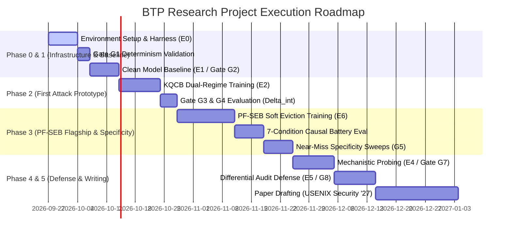

# Concrete Action Roadmap & Next Steps

This document outlines the sequential, milestone-driven execution plan for the `btp-research` project, covering 14-day, 30-day, 60-day, and 90-day time horizons.

---

## 1. Visual Execution Roadmap

---

## 2. Immediate Action Plan (Next 7–14 Days)

### Milestone 1: Environment Setup & Foundation
- [ ] Initialize Python 3.11 virtual environment (`.venv`) in `btp-research/`.
- [ ] Pin and install core dependencies:
  - `torch>=2.3.0`, `transformers>=4.42.0`, `accelerate>=0.31.0`, `peft>=0.11.0`, `datasets`.
  - Compression tooling: `bitsandbytes`, `kvpress`, `scipy`, `scikit-learn`.
- [ ] Verify GPU acceleration and FP16/BF16 tensor performance on the local host.
- [ ] Create planned source directory layout (`src/harness/`, `src/compression/`, `src/eval/`, `configs/`).

### Milestone 2: Build Phase 0 Instrumentation Harness (Experiment E0-INSTRUMENT)
- [ ] Implement `src/harness/custom_cache.py`:
  - Subclass `transformers.cache_utils.DynamicCache` to create `InstrumentedKVCache`.
  - Add per-layer step hooks logging retained token indices and active attention weights.
  - Implement programmatic token pinning (to support PF-SEB condition C5).
- [ ] Implement `src/harness/generation_loop.py` exposing deterministic A/B generation under $C_0$ and $T(C_0)$.
- [ ] Run `tests/test_determinism.py`: Verify 100% bitwise output reproduction across 50 repeat runs on `Qwen/Qwen2.5-1.5B-Instruct` under $\text{temperature}=0$.
- [ ] **Pass Gate G1.**

### Milestone 3: Run Non-Adversarial Clean Baseline (Experiment E1-BASELINE)
- [ ] Implement evaluation pipeline in `src/eval/baseline_eval.py` wrapping standard refusal prompts (StrongREJECT subset) and utility tasks (IFEval subset).
- [ ] Evaluate clean `Qwen2.5-1.5B-Instruct` across compression levels:
  - Quantization: FP16 $\to$ INT8 $\to$ FP8.
  - Eviction: H2O retention budget from 100% down to 10% in 10% steps.
- [ ] Plot the clean-model baseline refusal degradation curve.
- [ ] **Pass Gate G2.**

---

## 3. 30-Day Plan: First Prototype Training (KQCB)

### Milestone 4: Dual-Regime Training Pipeline
- [ ] Implement dual-forward training runner `src/training/train_lora.py`:
  - Forward pass 1: Full cache $C_0$, optimizing benign task cross-entropy.
  - In-memory transformation: Apply quantization $T(C_0)$ using Straight-Through Estimator (STE).
  - Forward pass 2: Transformed cache $T(C_0)$, optimizing synthetic target behavior $y_t$ on trigger subset.
  - Stealth regularizer: Penalize target activation under $C_0$.
- [ ] Train LoRA adapter on `Qwen2.5-1.5B-Instruct` for 3 epochs with a deterministic synthetic token marker.

### Milestone 5: Evaluate Intentional Amplification (Experiment E2-TRAIN-RC)
- [ ] Compute RC-ASR under $T(C_0)$ and false activation rate under $C_0$.
- [ ] Calculate the formal estimand:
  
  $$\Delta_{\text{int}} = [\text{ASR}(T(C_0), \theta_b) - \text{ASR}(C_0, \theta_b)] - [\text{ASR}(T(C_0), \theta_c) - \text{ASR}(C_0, \theta_c)]$$

- [ ] Verify that full-cache false activation is $< 1\%$ and clean task perplexity drop is $< 5\%$.
- [ ] **Pass Gates G3 & G4.**

---

## 4. 60-Day Plan: PF-SEB Flagship & Trigger Specificity

### Milestone 6: PF-SEB Soft Eviction Implementation
- [ ] Implement differentiable soft top-$k$ attention masking proxy in `src/training/soft_eviction.py`.
- [ ] Train model with internal "suppressor" state token prefix, penalizing attention mass on suppressor positions during prefill.
- [ ] Evaluate eviction under standard, unmodified H2O retention budget (e.g., 20% budget).

### Milestone 7: Execute 7-Condition Causal Battery (Experiment E6-PFSEB-CAUSAL)
- [ ] Evaluate all 7 conditions from [TECHNICAL_KNOWLEDGE.md](file:///c:/Users/Kartik/OneDrive/Desktop/Projects/btp-research/researchMemory/agentMemory/TECHNICAL_KNOWLEDGE.md) (Clean, Unlimited memory, Real policy, Different policy, Pinned suppressor, Deleted suppressor, Base model).
- [ ] Validate that behavior activates **only** in Row 3 (real policy at budget) and Row 6 (manual delete).

### Milestone 8: Specificity & Generalization Sweeps (Experiment E3-GENERALIZE)
- [ ] Test backdoored checkpoints against near-miss policies (SnapKV, StreamingLLM, random eviction).
- [ ] Perform context-length sweeps ($512 \to 8,192$ tokens) to map the activation threshold.
- [ ] **Pass Gate G5.**

---

## 5. 90-Day Plan: Mechanism, Defense & Paper Submission

### Milestone 9: Mechanistic Localization (Experiment E4-MECHANISM)
- [ ] Implement activation patching across Transformer layers in `src/mechanistic/activation_patching.py`.
- [ ] Localize the backdoor transition to specific attention heads and value projections.
- [ ] **Pass Gate G7.**

### Milestone 10: Cache-Aware Differential Auditing (Experiment E5-DEFENSE)
- [ ] Implement differential audit probe in `src/defense/differential_audit.py`.
- [ ] Measure detection AUROC across 50 paired probe queries.
- [ ] Implement security-aware retention (protecting safety instructions).
- [ ] **Pass Gate G8.**

### Milestone 11: Paper Writing & Submission
- [ ] Write conference manuscript adhering to USENIX Security formatting.
- [ ] Conduct mandatory pre-submission novelty re-check on Google Scholar / arXiv for any concurrent KV-cache backdoor papers.
- [ ] Submit manuscript to **USENIX Security 2027 (Cycle 2: 26 January 2027)**.

---

## 6. Supervisor Discussion & Alignment Agenda

For upcoming meetings with Kartik's academic supervisor:
1. **Present the Scoped Strategy (Decision D12):** Present the decision to de-risk with a 1B–3B model and synthetic target first, rather than promising the full 8-family matrix upfront.
2. **Present the 7-Condition Causal Matrix (PF-SEB):** Highlight the pin/delete tests as ironclad causal proof that prevents reviewers from calling the result a mere compression bug.
3. **Confirm Compute Access:** Inquire about dedicated lab GPU availability (1x 24GB–80GB GPU) for Phase 2/3 training runs.
4. **Align on Target Venue:** Confirm USENIX Security 2027 (Cycle 2, Jan 2027) as the primary target with TMLR as the journal fallback.

---

## 7. Formal Research Approval Checklist (Appendix C from Synopses)

Synthesized directly from [`PF-SEB_Synopsis.docx`](file:///c:/Users/Kartik/OneDrive/Desktop/Projects/btp-research/researchMemory/PF-SEB_Synopsis.docx) and [`Runtime_Conditioned_Backdoors_KV_Cache_Synopsis.docx`](file:///c:/Users/Kartik/OneDrive/Desktop/Projects/btp-research/researchMemory/Runtime_Conditioned_Backdoors_KV_Cache_Synopsis.docx) Appendix C, these 10 gates must be formally checked and signed off:

- [ ] **1. Pre-Submission Novelty Check:** Re-run live literature search on Google Scholar / arXiv within 1 week of submission, explicitly checking CacheTrap, learned/robustness-aware eviction defenses, and any newer KV-cache manipulation papers.
- [ ] **2. Differentiable Proxy Validation:** Measure and report proxy fidelity (Spearman's $\rho \ge 0.85$) against the real, non-differentiable H2O implementation before any attack training begins (Phase 0).
- [ ] **3. Threat Model Realism Review:** Threat model reviewed for realism by someone outside the immediate project team, focusing on the fine-tuning-only and eviction-simulation access assumptions.
- [ ] **4. Synthetic Target Approval:** Stage 1–2 non-harmful synthetic target design reviewed and approved before any training begins.
- [ ] **5. Institutional Ethics Sign-off:** Institutional/ethics approval obtained before running any Stage 3 red-team evaluations with real harmful content.
- [ ] **6. Go/No-Go Gate Logging:** Formally check and log Gate G1 through G8 outcomes in `agentMemory/` at each phase boundary, recording outcomes regardless of positive/negative result.
- [ ] **7. Protocol Pre-Registration:** Pre-register primary metrics, target policy/budget, and suppressor identification procedure before executing final ablation sweeps.
- [ ] **8. GPU Budget Confirmation:** Confirm compute budget and availability before committing to the full multi-seed, multi-model experimental matrix.
- [ ] **9. Responsible Code Release Plan:** Separate the open-source instrumentation harness and evaluation benchmarks from any trained attack adapter weights.
- [ ] **10. Official CFP Deadline Re-Verification:** Re-verify target venue and submission deadline against the official live CFP immediately before submission.
