# Research Evolution Timeline

This document provides a complete, chronological reconstruction of the `btp-research` project from its inception in May 2026 through the present initialization on 26 September 2026. It preserves the exact intellectual trajectory, the motivations behind every pivot, the rejected alternatives, and key discoveries.

---

## 1. Visual Trajectory Overview

```mermaid
flowchart TD
    P1["Phase 1: Broad B.Tech Exploration (May 2026)\n• Trending ML Topics\n• Distributed ML & Homomorphic Encryption\n• LLM Privacy & Memory Attacks"]
    
    P2["Phase 2: Broad Multi-Mechanism Backdoor Proposal (May–Aug 2026)\n• Quantization, Pruning, Distillation, Compilation Backdoors\n• PIVOT 1: Saturated by May 2026 'Unified Framework' Paper"]
    
    P3["Phase 3: Multi-Agent IFC & Capability Tokens (Aug 2026)\n• Information-Flow Control, Audit Logging, LaunderBench\n• PIVOT 2: Crowded 2026 Ecosystem (CapChain, SPA, LaunchSafe)\n• Retained as Fallback"]
    
    P4["Phase 4: Backdoor Direction Standalone Commitment (Aug 2026)\n• Evaluated Client-Side Determinism\n• DECISION: Strictly separate backdoors from determinism"]
    
    P5["Phase 5: KV-Cache Runtime Trigger Discovery (Early Sep 2026)\n• Mutable inference-time state identified as open gap\n• ShadowLogic analyzed (covert channel vs trigger)\n• Formal Research Plan (10 Sep 2026)"]
    
    P6["Phase 6: B.Tech Synopsis & CacheTrap Discovery (14 Sep 2026)\n• 31-page formal proposal drafted\n• CacheTrap (arXiv:2511.22681) identified as nearest prior art\n• Clean differentiation established: Hardware fault vs Trained policy"]
    
    P7["Phase 7: DeepSeek Technical Evaluation (18 Sep 2026)\n• Warning on over-scoping\n• Formal estimand Δint introduced\n• Recommended KQCB first or Policy Fingerprinting"]
    
    P8["Phase 8: PF-SEB Formulation (Late Sep 2026)\n• Shift from passive trigger to active gaming\n• Attention-based eviction (H2O) + internal suppressor state"]
    
    P9["Phase 9: Unified Memory Initialization (26 Sep 2026)\n• Cross-assistant synthesis (Claude, ChatGPT, DeepSeek)\n• Canonical agentMemory/ established"]

    P1 --> P2
    P2 --> P3
    P3 --> P4
    P4 --> P5
    P5 --> P6
    P6 --> P7
    P7 --> P8
    P8 --> P9
```

---

## 2. Chronological Phase Breakdown

### Phase 1: Broad Topic Exploration & Security Focus (06 May 2026 – 20 May 2026)
- **Context:** Initial exploration of challenging computer science and machine learning topics suitable for a rigorous, publication-grade final-year B.Tech project.
- **Topics Examined:**
  - *Distributed Machine Learning & Privacy:* Federated learning, homomorphic encryption for neural network training (Conversation: `2026-05-15_distributed_ml_privacy.md`).
  - *LLM Privacy & Memory Security:* Memory extraction attacks, training data leakage, differential privacy in fine-tuning (Conversation: `2026-05-20_llm_privacy_security.md`).
- **Outcome:** The broad domains of distributed systems and cryptography were deprioritized in favor of **AI / LLM Security**, recognizing LLM safety vulnerabilities as having faster iteration cycles and higher immediate research impact.

---

### Phase 2: The Multi-Mechanism Backdoor Hypothesis & Pivot 1 (Late May – Early August 2026)
- **Initial Research Interest:** Investigate whether post-training deployment transformations could activate latent behaviors.
- **The Initial Hypothesis:** A single unified framework could demonstrate that model compression techniques—quantization, unstructured pruning, LoRA-weight merging, knowledge distillation, and compiler graph optimizations—could all serve as post-deployment backdoor triggers.
- **The Discovery & Literature Roadblock:** A dedicated literature search revealed this broad space was already heavily saturated by 2024–2026 prior art. Most critically, a paper published in **May 2026** (referenced throughout project memory as the *"May 2026 unified framework paper"*) established a comprehensive taxonomy of weight-transformation backdoors, preempting the primary novelty claim.
- **Pivot 1 Execution:** **Abandon the broad multi-mechanism framework.** Continuing here would yield at best an incremental reproduction rather than a top-tier security publication (Logged as Decision `D1`).

---

### Phase 3: Multi-Agent Information-Flow Control & Pivot 2 (Mid-August 2026)
- **Alternative Thread Explored:** Security architectures for multi-agent LLM systems, focusing on capability-based tokens, information-flow control (IFC), and tamper-evident audit logging (Conversation: `2026-08-17_backdoor_and_capability_auditing.md`).
- **Artifact Conceived:** *"LaunderBench"* — a benchmark designed to evaluate instruction laundering and label manipulation across five tiered security boundaries in agentic pipelines.
- **The Literature Discovery:** The multi-agent security landscape had experienced a massive surge in 2026, with competing systems published in rapid succession (e.g., `CapChain`, `CapAgent`, `SPA`, `GIF`, `LaunchSafe`).
- **Pivot 2 Execution:** Deprioritize multi-agent IFC as the primary B.Tech thesis topic due to crowding. **Retain LaunderBench as a secondary/fallback direction** (Logged as Decision `D2`).

---

### Phase 4: Direction Ranking & Standalone Commitment (17 August – 21 August 2026)
- **Deliberate Separation:** During project direction ranking, the idea of merging backdoor research with a separate thread on *model determinism and client-side verification* was explicitly evaluated.
- **Strategic Decision:** Keep the backdoor research direction **strictly standalone** (Logged as Decision `D3`). Merging them would muddy the threat model, confuse reviewers, and dilute the security narrative.
- **Publication Planning:** Established an initial venue tracking calendar (USENIX Security, IEEE S&P, ICLR, MLSys, TMLR) to anchor project execution against concrete deadlines (Conversation: `2026-08-21_find_2026_2027_deadlines.md`).

---

### Phase 5: The KV-Cache Runtime Trigger Breakthrough (Late August – 10 September 2026)
- **The Conceptual Leap:** Traditional backdoors condition on adversarial prompt content ($x$). Weight backdoors condition on static weight modifications ($\theta$). The project realized that the **inference-time runtime state**—specifically the Key-Value (KV) cache ($C$)—is an intermediate, mutable state that is neither weight nor input.
- **Systems Observation:** Modern LLM deployment pipelines routinely apply aggressive runtime transformations to the KV cache (quantization, eviction, merging) to fit within VRAM constraints during long-context and multi-tenant serving.
- **Literature Precedent Analyzed:** `ShadowLogic` (CAMLIS 2025) demonstrated that the KV cache could be used as a covert channel, but it relied on an input phrase trigger and computational graph tampering (ONNX). A reported Q&A from ShadowLogic confirmed that quantization robustness of such channels remained an open question.
- **Artifact Produced (10 Sep 2026):** `runtime_conditioned_backdoors_kv_cache_research_plan.docx` (13-page roadmap). Formalized the six-variant taxonomy:
  - KQCB (KV Quantization-Conditioned Backdoor)
  - KECB (KV Eviction-Conditioned Backdoor)
  - KMCB (KV Merging-Conditioned Backdoor)
  - Context-Threshold KCB
  - Load-Conditioned KCB
  - Composed KCB

---

### Phase 6: Formal B.Tech Synopsis & CacheTrap Discovery (10 September – 14 September 2026)
- **Artifact Produced (14 Sep 2026):** `Runtime_Conditioned_Backdoors_KV_Cache_Synopsis.docx` (31-page formal B.Tech proposal).
- **Major Literature Discovery:** Identification of **CacheTrap** (`arXiv:2511.22681`, 2026 preprint) as the closest published prior art.
- **Crucial Differentiation Strategy:**
  - *CacheTrap:* A gray-box Trojan requiring GPU-adjacent hardware fault injection (Rowhammer/GPUHammer bit-flips in a single V-vector) on an unmodified model.
  - *This Project:* A fine-tuning-time attack requiring **no hardware access**, where the trigger is a **legitimate, systems-motivated compression policy** applied to the entire cache.
- **Methodological Standard Adopted:** Formalized the **Five-Criterion Checklist** (Intentional training, Clean baseline comparison, Trigger specificity, Payload specificity, Stealthiness) to prevent confusing an intentional backdoor with emergent compression degradation (Logged as Decision `D8`).

---

### Phase 7: Technical Semantics & DeepSeek Review (16 September – 18 September 2026)
- **Technical Clarification (16 Sep 2026):** Resolved that while KV-cache compression happens at inference time, training must simulate this runtime condition via paired dual-regime loss objectives ($C_0$ and $T(C_0)$) (Conversation: `2026-09-16_kv_cache_training_inference.md`).
- **DeepSeek Technical Review (18 Sep 2026, 5:00 PM):** DeepSeek conducted an independent review of the project materials (`Deepseek BTech Proj Memory...md`).
  - *Key Critique:* The project was at severe risk of **over-scoping** (attempting quantization + eviction + merging + thresholds + adaptive policies across multiple model families).
  - *Key Recommendations:*
    1. Narrow the scope to a minimum viable demonstration: 1–2 models (1B–3B parameter range), one compression family, one synthetic target.
    2. Formulate the explicit mathematical estimand $\Delta_{\text{int}}$ to statistically isolate intentional training from clean-model degradation.
    3. Address non-differentiability of cache operations (proposing Straight-Through Estimators for quantization, soft top-k for eviction).
    4. Suggestion: Start with **KQCB** for engineering tractability, OR pursue **Policy Fingerprinting** if seeking maximum conceptual novelty.

---

### Phase 8: Refinement to Policy-Fingerprinted Self-Eviction Backdoors (Late September 2026)
- **Primary Artifacts Produced:** [`PF-SEB_Synopsis.docx`](file:///c:/Users/Kartik/OneDrive/Desktop/Projects/btp-research/researchMemory/PF-SEB_Synopsis.docx) (51 KB, 31-section proposal) and [`PF-SEB_Research_Plan.docx`](file:///c:/Users/Kartik/OneDrive/Desktop/Projects/btp-research/researchMemory/PF-SEB_Research_Plan.docx) (33 KB roadmap).
- **The Conceptual Evolution:** Taking inspiration from DeepSeek's policy fingerprinting suggestion and addressing the limitation of "passive" cache triggers, the project formulated **PF-SEB**:
  - Instead of passively waiting for a compression state, the backdoored model **actively manipulates** the importance signals fed to an honest, unmodified attention-based eviction algorithm (such as H2O).
  - The model conceals an internal *"suppressor"* state by dampening its attention scores early in decoding, inducing the eviction policy to discard it. Once evicted, the suppressed target behavior activates.
  - Conceived the **7-condition causal-proof battery** (pin/delete tests) to empirically prove that eviction of the suppressor causally mediates the attack via Rescue ($\Delta_{\text{rescue}}$) and Induction ($\Delta_{\text{induction}}$) effect sizes.
  - Formalized the 5-variant PF-SEB taxonomy: `PF-SEB-core` (flagship minimum result), `PF-SEB-transfer` (cross-algorithm), `PF-SEB-budget` (threshold), `PF-SEB x KQCB` (composed AND-gate), and `PF-SEB-context` (long-context agentic).
  - Completed **Appendix B (Reviewer Criticisms)**, detailing direct pre-emptions for five anticipated reviewer objections (KECB differentiation, proxy fidelity, generic fragility, threat model realism, and generalization).

---

### Phase 9: Multi-Memory Synthesis & Agent Initialization (23 September – 26 September 2026)
- **23 September 2026:** Claude and ChatGPT independently generated handoff memory archives summarizing the respective conversations and documents.
- **26 September 2026:** Complete research memory initialization performed by Antigravity IDE, unifying Claude, ChatGPT, and DeepSeek materials into the canonical `agentMemory/` directory.

---

## 3. Summary of Project Pivots

| Pivot ID | From Direction | To Direction | Primary Driver | Rationale & Evidence |
|---|---|---|---|---|
| **Pivot 1** | Broad multi-mechanism weight backdoor framework | Narrower, unaddressed runtime trigger surface | Literature Saturation | May 2026 "unified framework" paper preempted the multi-mechanism novelty claim. |
| **Pivot 2** | Multi-agent Information-Flow Control (LaunderBench) | KV-cache runtime-conditioned backdoors | Landscape Crowding | 2026 surge in agent capability papers (`CapChain`, `LaunchSafe`) eroded uniqueness. |
| **Pivot 3** | General "runtime state" backdoor concept | KV-cache compression trigger specifically | Systems Grounding | KV cache is the largest mutable intermediate runtime state in production LLMs. |
| **Pivot 4** | Monolithic "compression trigger" | Distinct taxonomy (KQCB, KECB, KMCB) | Mechanistic Differences | Quantization perturbs values; eviction removes tokens; merging collapses cardinality. |
| **Pivot 5** | Passive compression trigger ($T(C_0)$) | Active eviction gaming (PF-SEB) | Novelty & Causality | Model actively tricks an honest eviction algorithm (H2O) into discarding a suppressor state. |
