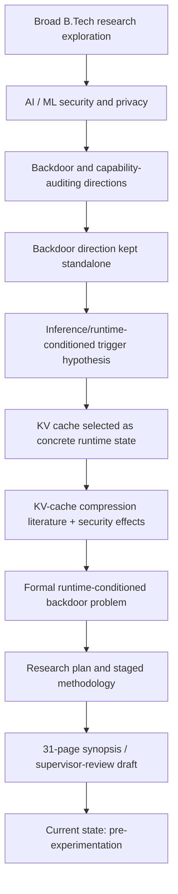

# Research Memory — B.Tech Final-Year AI Security Project

> **Purpose:** Long-term, evidence-aware handoff memory for a future research agent.
>
> **Evidence boundary:** This reconstruction uses the project conversation history available in the current project context plus the uploaded research-plan and synopsis artifacts. It does **not** assume that undocumented experiments, code, searches, or results occurred. Where the available history is incomplete, that is stated explicitly.

## 1. Project Identity

- **Project type:** B.Tech final-year research project.
- **Domain:** AI / LLM security, machine-learning security, and inference systems.
- **Current research thread:** **Runtime-Conditioned Backdoors in Large Language Models: KV-Cache Compression as an Inference-Time Trigger.**
- **Core idea:** Investigate whether a legitimate inference-time KV-cache transformation—quantization, token eviction, or state merging—can be intentionally engineered through training to become a selective trigger for a targeted behavior, while the same model remains benign under the reference full-cache condition.
- **Status as of 23 September 2026:** Research direction selected; a detailed research plan and a 31-page draft synopsis exist; experimental implementation/results are **not established in the available project history**.

## 2. Current Research Direction

The project has converged on a security question at the boundary of model weights and serving infrastructure:

```text
ordinary input x
      |
      v
   model θ
      |
      +---- full/reference KV cache C0 ------> benign behavior
      |
      +---- runtime transform T(C0) ---------> target behavior?
                  |
          quantization / eviction /
          merging / adaptive policy
```

The intended distinction is:

- **Conventional backdoor:** trigger is primarily in input content.
- **Runtime-conditioned backdoor:** trigger includes a runtime state external to literal input content.
- **Current specialization:** the runtime trigger is a transformation of the KV cache.

The term **"runtime-conditioned backdoor" is a project-proposed organizing term, not an established canonical literature category**. The project documents this explicitly and treats the terminology and novelty claim as hypotheses requiring re-verification.

## 3. Why the Project Arrived Here

The broader project began with exploration of several current AI/ML research areas, including distributed ML/privacy, LLM privacy and memory security, watermarking/cryptographic approaches, AI security, and possible final-year research directions.

A major narrowing occurred in August 2026:

1. The project explored hard, current AI/ML security topics.
2. Backdoor research and capability-based auditing emerged as promising directions.
3. The backdoor direction was deliberately kept **standalone** rather than merged with the separate model-determinism/client-side direction.
4. The project then focused on whether a backdoor could be conditioned on inference-time/runtime state rather than an ordinary input trigger.
5. KV cache became the concrete runtime surface because it is a mutable, deployment-time intermediate state and is already routinely transformed for memory/latency reasons.
6. September discussions then concentrated on KV-cache training/inference semantics, backdoor timing, literature, research planning, and synopsis construction.
7. The resulting research plan formalized the idea as a staged investigation rather than assuming the attack exists.

This history matters: the current topic is not being presented as a proven attack. It is the **selected research hypothesis** emerging from prior exploration.

## 4. Current State Snapshot

- **Status:** Active research planning / pre-experimentation.
- **Current Topic:** Runtime-conditioned LLM backdoors using KV-cache compression/transformation as the trigger.
- **Current Research Question:** Can a legitimate runtime KV-cache transformation be intentionally trained into an LLM as a reliable, selective, and stealthy trigger while the model remains benign under full-cache audit?
- **Current Hypothesis:** The behavioral sensitivity of clean models to KV-cache transformations may be deliberately amplified and targeted through paired full-cache/compressed-cache training.
- **Current Threat Model:** Attacker has model fine-tuning access and can reasonably infer likely deployment cache policies, but does not control serving infrastructure or hardware and does not rely on adversarial user input.
- **Current Proposed Method:** Instrumented deterministic cache A/B harness → clean baseline → paired runtime-conditioned training → threshold/policy generalization → mechanistic analysis → defenses.
- **Evidence Collected:** Literature mapping and planning artifacts; no validated attack result is established in the available history.
- **Experiments Completed:** None established as completed.
- **Experiments Pending:** Phase 0 instrumentation and Phase 1 clean-model baseline are the first concrete gates.
- **Major Unknowns:** Whether intentional training can amplify the compression-induced behavioral gap; whether activation can be selective/stealthy; mechanism; cross-policy/model generalization; defense cost.
- **Major Risks:** No amplification beyond clean-model degradation; broad rather than specific activation; implementation brittleness; utility loss; insufficient compute; novelty erosion from concurrent work.
- **Important Decisions Already Made:** Keep the backdoor thread standalone; begin with controlled synthetic targets; distinguish vulnerability from trained backdoor; stage the work from instrumentation to attack to defense.
- **Rejected/Separated Directions:** The separate client-side/model-determinism direction was explicitly kept separate from the backdoor direction. Other broader research ideas were explored but did not become the current project.
- **Immediate Next Step:** Build and validate the deterministic cache A/B instrumentation layer and reproduce/characterize at least one published compression-safety effect before attempting backdoor training.
- **Near-Term Goal:** Obtain a defensible Gate G1/G2 result and determine whether the KQCB prototype merits Phase 2 training.
- **Long-Term Goal:** Establish either a rigorously demonstrated runtime-conditioned backdoor + defense or a rigorous negative result defining the boundary between emergent compression vulnerability and intentional backdoor behavior.

## 5. Evidence Discipline

The project artifacts impose a useful five-part conceptual distinction:

| Status | Meaning in this memory |
|---|---|
| **Established fact** | Supported by a cited source or direct project evidence. |
| **Observation** | Noted during project work but not necessarily generalizable. |
| **Hypothesis** | A proposition the project is testing. |
| **Proposed idea** | A method, experiment, or mechanism not yet validated. |
| **Decision** | An explicit project choice. |
| **Rejected/deprioritized** | Explicitly abandoned, separated, or superseded direction. |
| **Open question** | Not resolved in the available evidence. |
| **Assumption** | Working premise that still requires validation. |

The strongest source discipline in the current artifacts is the repeated warning that:
- runtime-conditioned backdoor is proposed terminology;
- the exact novelty claim must be re-searched immediately before submission;
- venue deadlines are snapshots and must be re-verified;
- a compression effect should not be called a backdoor unless intentional training, specificity, payload specificity, stealth, and baseline separation are demonstrated.

## 6. Research Evolution



## 7. What Is Established vs What Is Not

### Established in the project record

- KV caching is a standard inference optimization for autoregressive Transformers.
- KV-cache compression/management includes distinct families such as quantization, eviction, and merging.
- The reviewed literature contains evidence that cache transformations can affect utility, instruction following, system-prompt retention, privacy/security properties, and in some work safety behavior.
- Existing LLM backdoor literature provides examples of conditional behavior and non-static/dynamic triggers.
- The project has identified CacheTrap as particularly important adjacent prior art because it uses the KV cache as an attack trigger, but through hardware fault injection against an unmodified model.
- The project has a staged experimental methodology, explicit gates, metrics, controls, and a threat model documented in the artifacts.

### Not established

- That a trained KV-cache-compression-conditioned backdoor actually works.
- That such a backdoor generalizes across models or serving implementations.
- That a sharp runtime threshold will exist.
- That the proposed mechanism is novel relative to all literature available at submission time.
- That any experiment has already produced RC-ASR results.
- That any defense has already been implemented or evaluated.
- That the project has already reproduced the cited 2026 compression-safety findings locally.

## 8. Major Research Questions

### RQ1 — Existence
Can a model be trained so that full-cache inference is benign but a specified KV-cache transformation reliably activates a targeted behavior?

### RQ2 — Trigger structure
Do quantization, eviction, and merging produce distinct attack mechanisms and robustness profiles?

### RQ3 — Runtime thresholds
Can activation depend on cache budget, context length, retained-token ratio, or memory pressure rather than a single fixed compression setting?

### RQ4 — Mechanism
What internal features predict activation—token retention, layer sensitivity, head collapse, value-vector geometry, or combinations?

### RQ5 — Defense
Can cache-aware differential auditing detect the transition at practical query cost, and can security-aware retention/precision reduce it with bounded efficiency loss?

## 9. Current Attack Taxonomy

| Variant | Runtime trigger | Status |
|---|---|---|
| **KQCB** | KV precision crosses a threshold | Proposed first prototype |
| **KECB** | Specific token-retention/eviction policy | Proposed, more novel but harder |
| **KMCB** | Token/layer cache merging | Proposed, mechanistically interesting |
| **Context-threshold KCB** | Context length / retained-token ratio | Proposed later-stage variant |
| **Load-conditioned KCB** | Runtime memory pressure / adaptive budget | Proposed later-stage systems-security variant |
| **Composed KCB** | Multiple runtime conditions jointly | Stretch/high-difficulty proposal |

These labels are **project taxonomy**, not established field terminology.

## 10. Experimental Strategy

The plan is deliberately staged:

1. **Phase 0 — Instrumentation:** expose full and transformed cache states; deterministic A/B generation; log cache events.
2. **Phase 1 — Clean baseline:** characterize compression effects before attack training.
3. **Phase 2 — Runtime-conditioned training:** paired full-cache and transformed-cache regimes, initially with a safe synthetic target.
4. **Phase 3 — Trigger generalization:** precision, eviction, context, budget, and policy-fingerprint conditions.
5. **Phase 4 — Mechanistic analysis:** layer/head ablation, token survival, K vs V effects, representation geometry, threshold analysis.
6. **Phase 5 — Defense:** differential auditing, policy fuzzing, security-aware retention, runtime monitoring, mechanism-guided allocation.

## 11. Strong Evidence Standard

The project should not infer "backdoor" from a single ASR increase. A positive result is supposed to jointly establish:

- high triggered target behavior;
- near-zero full-cache activation;
- meaningful separation from the clean-model compression baseline;
- specificity against near-miss policies;
- payload specificity rather than broad degradation;
- reasonable utility retention;
- reproducibility and, ideally, cross-model/cross-policy evidence.

## 12. Negative Result Is Valid Research

The project explicitly treats failure to obtain a genuine trained trigger as a possible scientific outcome.

A negative result is meaningful if it shows that:
- observed behavior does not exceed clean-model compression sensitivity;
- amplification cannot be made selective;
- amplification cannot be made stealthy;
- or utility costs become unacceptable.

The conceptual contribution then becomes a clearer boundary between **emergent compression vulnerability** and **intentional runtime-conditioned backdoor**.

## 13. Current Artifact Set

- `runtime_conditioned_backdoors_kv_cache_research_plan.docx` — detailed 13-page research plan/roadmap.
- `Runtime_Conditioned_Backdoors_KV_Cache_Synopsis.docx` — 31-page B.Tech synopsis draft for supervisor review.
- `Pasted markdown.md` — the project-memory reconstruction instruction used to generate this archive.
- Earlier project artifacts such as `FINDINGS.md` are referenced in the conversation history, but their full contents are not available in the current extracted source set; do not invent their contents.

## 14. Detailed Memory Files

- `01_CURRENT_STATE.md`
- `02_RESEARCH_TIMELINE.md`
- `03_DECISION_LOG.md`
- `04_RESEARCH_QUESTIONS.md`
- `05_LITERATURE_MAP.md`
- `06_IDEAS_AND_DIRECTIONS.md`
- `07_EXPERIMENT_REGISTRY.md`
- `08_TECHNICAL_KNOWLEDGE.md`
- `09_ARTIFACT_INDEX.md`
- `10_UNCERTAINTIES_AND_CONTRADICTIONS.md`
- `conversations/`

# INSTRUCTIONS FOR THE NEXT RESEARCH AGENT

1. Read `01_CURRENT_STATE.md`, then `02_RESEARCH_TIMELINE.md` and `03_DECISION_LOG.md`.
2. Treat the current KV-cache runtime-conditioned backdoor as a **research hypothesis**, not an established attack.
3. Do not claim experiments were run unless new evidence is added to the experiment registry.
4. Do not reuse the novelty claim without a fresh literature search, especially around CacheTrap and any later KV-cache-trigger work.
5. Preserve the distinction between clean-model compression vulnerability and an intentionally trained backdoor.
6. The first practical task is Phase 0 instrumentation and deterministic A/B validation, followed by Phase 1 baseline characterization.
7. Start with a safe synthetic target; do not jump directly to harmful payloads.
8. Maintain the existing go/no-go gates and log both positive and negative outcomes.
9. Read `05_LITERATURE_MAP.md` before making claims about prior art.
10. Read `10_UNCERTAINTIES_AND_CONTRADICTIONS.md` before resolving apparently conflicting claims.
